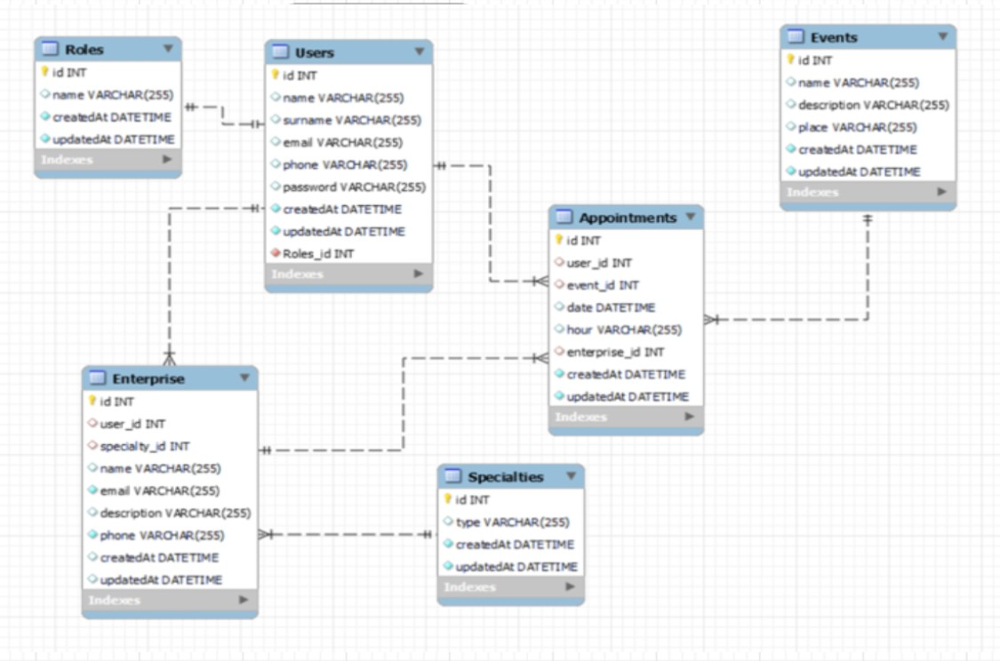
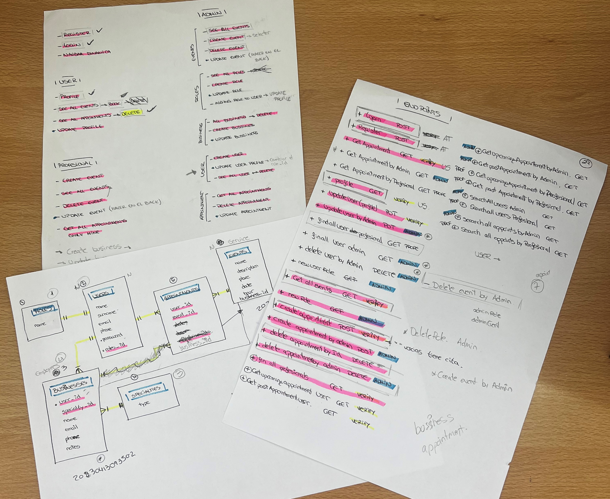

# Welcome to Meet Me At backend app
<p align="center"></p> 

<details>
  <summary>Index</summary>
  <ol>
    <li><a href="#meet-me-at-app">About Meet Me At App</a></li>
    <li><a href="#stack">Stack</a></li>
    <li><a href="#diagram-bd">Diagram DB</a></li>
    <li><a href="#local-installation">Local installation</a></li>
    <li><a href="#how-i-have-done-it">How I have done it</a></li>
    <li><a href="#project-structure">Project structure</a></li>
    <li><a href="#data-base">Database</a></li>
    <li><a href="#endpoints">Endpoints</a></li>
    <li><a href="#future-functionalities">Future funtionalities</a></li>
    <li><a href="#licence">Licence</a></li>
    <li><a href="#webgraphy">Webgraphy</a></li>
    <li><a href="#contact">Contact</a></li>
  </ol>
</details>

## Meet Me At App
<p align="center">Meet Me At is an event platform that connects businesses and users, by allowing businesses to showcase their events and users to register for events that interest them, the platform creates a community of like-minded individuals. 
Additionally, by providing event management tools, the platform helps businesses and event organizers organize and keep participants updated on event details. Meet Me At is a useful and valuable tool for those looking to connect with others and participate in exciting events.</p>

## Stack
<p>Technologies that has been used:</p>
<div align="center">
    <a href="https://expressjs.com/">
        
    </a>
    <a href="https://nextjs.org/">
        
    </a>
    <a href="https://developer.mozilla.org/es/docs/Web/JavaScript">
        
    </a>
    <a href="https://jwt.io/">
        
    </a>
    <a href="https://www.postman.com/">
        
    </a>
    <a href="https://www.mysql.com/">
        
    </a>
    <a href="https://www.github.com/">
        
    </a>
    <a href="https://git-scm.com/">
        
    </a>
    <a href="https://www.docker.com/">
        
    </a>
    <a href="https://www.sequelize.org/">
        
    </a>
</div>

## Diagram DB


## Local installation

Steps to make it work on your local computer:
1. Clone the project on your computer with git bash:
 `$git clone 'url-repository'`
1. Install all dependencies with the following command:
 ` $ npm i `
1. Create a .env file following the template .env.example provided and type all credentials. If you cannot get them, change the parameters for your own local database set up running in docker.
2.  Start the server with:
 ``` $ npm run dev ```
1. Connect the repository with the database with the following commands:
 ``` $ npx sequelize-cli db:create ``` 
 ``` $ npx sequelize-cli db:migrate ``` 
 ``` $ npx sequelize-cli db:seed:all ```

1. Import this file in postman to get the endpoints we have created:
[](https://www.postman.com/security-geologist-20366633/workspace/meet-me-at/collection/27251425-ef405e59-a70e-4b4b-ab64-610e2822de31?action=share&creator=27251425)


## How I have done it
<div align="center">
For the development of the application backend, technologies such as Node.js and Express were used to handle user requests and implement API endpoints. JavaScript was used as the main programming language.

To ensure the security of the application, an authentication and authorization system was implemented so that only authorized users have access to certain features of the application through JSON Web Tokens (JWT).

The database was created using MySQL and Sequelize of Node.js, which facilitates communication between the database and the application.

During the development process, the database was designed with all the relationships, making some modifications to make more sense of the app concept, such as removing the direct relationship between company and appointments and directly relating them to events, as can be seen in the following pictures:

 ||
|-|-|

Then, I was organized in terms of the requirements wanted for the application and all the endpoints of the project were marked.



</div>

## Project structure
I used model view controller to structure this project. I created a basic CRUD.
The project will have the following structure:
-	Index.js: This is the main file. From this file we call to routes file, express and middleware that will have all the routes called and the server is started.
-	Config.
      - Config.json: This file manages the configuration to connect to the database. It is created automatically with sequelize.
-	Middlewares: This file manages common services, such as authentication through use of tokens to access API restricted zones.
      - Is admin
      - Is prodessional
      - Verify token
-	db.js: Shows the configuration that must have into .env file that must be created for the application to work.
    ```PORT = PORT```
    ```JWT_SECRET = SECRET```

-	Router.js: This file manages the different paths that the application can have. A route will be created for each table in the database that we want to access, in addition to routing the authenticators.
-	Views:
      - appointmentRoutes.js: In this file we manage the path /appointments and the endpoints that point to that route.
      - AuthRoutes.js: In this file we manage the /auth path and the endpoints pointing to that path.
      - roleRoutes.js: In this file we manage the path /roles and the endpoints pointing to that path.
      - businessRoutes.js: In this file we manage the path /business and the endpoints that point to that route.
      -  eventRoutes.js: In this file we manage the path /event and the endpoints that point to that route.
      - specialtyRoutes.js: In this file we manage the path /specialty and the endpoints that point to that route.
      - usersRoutes.js: In this file we manage the /users path and the endpoints that point to that path.
      
-	Controllers: There are controllers for each of the established routes. The services that answer for them are entered into the controllers themselves through the routes.
-	.env.example: This file manages environment variables.

## DataBase
<div align="center">
The MySQL database used in this application has implemented several interconnected tables through relationships that allow for efficient and organized data storage and querying.

In this database, we find one-to-many (1:N) relationships such as between roles and users, allowing a role to have multiple users but a user can only have one role assigned. We also find the same relationship between users and business, and business and specialties. A user can have multiple business associated with them in the "business" table, while each company can only be associated with a specific user. Similarly, a company can have multiple specialties, while each specialty can only be associated with a specific company.

However, we find a many-to-many (N:N) relationship between users and events. This is because several users can be associated with several events through the appointments, and the other way around, an event can have multiple users associated with it through appointments. To implement this relationship, an intermediate table called "appointments" needs to be created, which will contain the foreign keys from the "users" and "events" tables.
</div>

## Endpoints

This project has 33 endpoints, with JSON Web Tokens authentication system.

Any user can access to:

<details>
<summary><strong>Auth</strong></summary>

- Register user:
    - Manage registration in our API. The information is passed via body in Postman containing the name, surname, email, phone and password.

        POST:   http://localhost:3000/register 
        body:
        ``` bash
        {
            "name": "Luisa",
            "surname": "Santo Ramos",
            "email": "luisa@gmail.com",
            "phone": "+34605789542",
            "password": "1234567A"
        }
        ```
    The password is encrypted using the crypto library, native to NodeJS, and then sent to the database.

- Login User: 
    - We manage the log in our API (secure so that only an administrator, professional or public can access it).

        POST:   http://localhost:3000/login
        body:
        ``` bash
        {
            "email": "luisa@gmail.com",
            "password": "1234567A"
        }
        ```
</details>

Users logged like a 'public' role can access the following endpoints:

<details>
<summary><strong>User</strong></summary>

- Profile: 
    - GET petition to see the user´s own profile.
  
        GET:   http://localhost:3000/profile

- Update profile: 
    - We update profile from the logged user.
  
        PUT:   http://localhost:3000/updateProfile
        body:
        ``` bash
       {
            "name": "Luisa",
            "surname": "Santo Ramos",
            "email": "luisa@gmail.com",
            "phone": "+34605789542",
        }
        ```

- Appointments:
    - CREATE appointment only for the logged in user through postman with POST option.

        POST:   http://localhost:3000/create/appointment
        body:
        ``` bash
        {
            "event_id": "2",
        }
        ```
    Only appointments can be created for the logged in user.

    - GET a list of all users' appointments'.
  
        GET:   http://localhost:3000/appointment

    - CANCEL petition to delete my own appointments currently in the database.
  
        DELETE:   http://localhost:3000/cancelappointment/:id

    You must indicate in the url the ID number of the appointment.

- Events:
    - GET a list of all events.
  
        GET:   http://localhost:3000/all/events

- Business:
    - GET a list of all business.
  
        GET:   http://localhost:3000/business

</details>

Users logged like an 'Professional' role can access to following endpoint:

<details>
<summary><strong>Professional</strong></summary>

- Check all user by business: 
    - GET petition to see a list of the users, if you are logged like a business, will show only the relevant information about the users.
  
        GET:   http://localhost:3000/getuserbyprofess

- Appointments: 
    - GET a list of all appointments for my own events.
  
        GET:   http://localhost:3000/getappointmentbyprofess

    This option displays all fields of interest to the business related to the appointment.

- Events: 
    - GET a list of all events that belong to my company.
  
        GET:   http://localhost:3000/all/events/professional

    This option displays all fields of interest to the business related to the event.

    - CANCEL petition to delete my own events currently in the database.
  
        DELETE:   http://localhost:3000/deleteeventprofessi/:id

    You must indicate in the url the ID number of the event.

    - CREATE event through postman with POST option.

        POST:   http://localhost:3000/neweventprofessional
        ``` bash
        {
            "image": "URL picture"
            "name": "Show name",
            "description": "description",
            "place": "place",
            "date": "year-month-date",
            "hour": "time"
        }
        ```
    Only events can be created for the logged business.

</details>

Users logged like an 'admin' role can access to following endpoint:

<details>
<summary><strong>Admin</strong></summary>

- User related functions: 
    - GET petition to see list all of users, if you are logged like an Admin, will show all the information about the users.
  
        GET:   http://localhost:3000/allusers

    - UPDATE any user profile from the logged Admin.

        POST:   http://localhost:3000//updateprofile/:id
        body:
        ``` bash
        {
            "name":"",
            "surname":"",
            "email":"",
            "phone":"",
            "role_id": ""
        }
        ```
        You must indicate in the url the ID number of the user.
    - DELETE user and all info by Admin.

        POST:   http://localhost:3000/cancelluser/:id
    
        You must indicate in the url the ID number of the user.

    - CREATE new user by admin with any role_id except 'admin' role.

        POST:   http://localhost:3000/newuseradmin
        body:
        ``` bash
        {
            "name": "Luisa",
            "surname": "Santo Ramos",
            "email": "luisa@gmail.com",
            "phone": "+34605789542",
            "password": "1234567A",
            "role_id": 2
        }
        ```
    The password is encrypted using the crypto library, native to NodeJS, and then sent to the database.

- Roles: 
    - GET petition to see list of all roles in the database.
  
        GET:   http://localhost:3000/role

    - GET petition to see list of all roles exclude admin role in the database.
  
        GET:   http://localhost:3000/roles

    - CREATE roles through postman with POST option.

        POST:   http://localhost:3000/newrole
        body:
        ``` bash
        {
	        "name": "team-leader"
        }
        ```
    - UPDATE any role except admin.

        POST:   http://localhost:3000/updateuserrole/:id
        body:
        ``` bash
        {
            "name":""
        }
        ```
        You must indicate in the url the ID number of the role.
    
    - CANCEL petition to delete roles currently in the database except admin.
  
        DELETE:   http://localhost:3000/deleterole/:id

    You must indicate in the url the ID number of the role.

- Specialty: 
    - GET petition to see list of all specialties in the database.
  
        GET:   http://localhost:3000/specialty

- Business: 
    - GET petition to see list of all business in the database.
  
        GET:   http://localhost:3000/business

    - CREATE business through postman with POST option.

        POST:   http://localhost:3000/newbusiness
        body:
        ``` bash
        {
	        "user_id": "10",
            "specialty_id": "3",
            "notes": "notes"
        }
        ```

    - CANCEL petition to delete business currently in the database.
  
        DELETE:   http://localhost:3000/deletebusiness/:id

    You must indicate in the url the ID number of the business.

- Events: 
    - GET a list of all events in the database.
  
        GET:   http://localhost:3000/all/events

    This option displays all fields of interest to admin related to the event.

    - CANCEL petition to delete events currently in the database.
  
        DELETE:   http://localhost:3000/deleteevent/:id

    You must indicate in the url the ID number of the event.

    - CREATE event through postman with POST option.

        POST:   http://localhost:3000/newevent
        body:
        ``` bash
        {
            "image": "URL picture"
            "name": "Show name",
            "description": "description",
            "place": "place",
            "date": "year-month-date",
            "hour": "time"
            "business_id": 2
        }
        ```
 - UPDATE any event by admin.
  
        PUT:   http://localhost:3000/updateeventadmin/:id
        body:
        ``` bash
       {
            "image": "image",
            "name": "show name",
            "description": "description",
            "place": "place",
            "date":"year-month-day",
            "hour": "time",
            "business_id": 4
        }
        ```
     You must indicate in the url the ID number of the event.

- Appointment: 
    - GET a list of all appointments.
  
            GET:   http://localhost:3000/getappointment

   This option displays all fields related to the appointment.

    - CREATE appointment by the admin for any user through postman with POST option.

            POST:   http://localhost:3000/newappointment
        body:
        ``` bash
        {
            "user_id": "user_id",
            "event_id":" event_id"
        }
        ```
    - CANCEL petition to delete any user appointments currently in the database.
  
            DELETE:   http://localhost:3000//deleteappointment/:id

    You must indicate in the url the ID number of the appointment.
</details>

## Future functionalities

Below we mention a few functionalities that remain to be implemented in this project:
   - I would like to introduce a feedback model to give the customer the option to write a review which will reach more customers.
   - Add functions to implement more search filters in appointments, events, etc...
   - Add funtions to see future and past events or appointments.
## Licence
This project is belonging to license Creative Commons Legal Code.


## Webgraphy
To achieve the goal we have collected information from:

[Sequelize documentation](https://sequelize.org/docs/v6/)
[Repository GeeksHubs](https://github.com/GeeksHubs/FSD_VAL_01_2023_SEQUELIZE)
[eventbrite-website](https://www.eventbrite.es/d/spain--valencia/events/)
[website-meetup](https://www.meetup.com/es-ES/)
Google fonts
[website-freepik](https://www.freepik.es/)

## Contact
Laura Sanchez Lucas

<a href = "laura:lausnclu@gmail.com"></a>
<a href="https://www.linkedin.com/in/laura-sanchez-lucas-5b2222251" target="_blank"></a> 
<a href="https://github.com/LauraSanchezLucas" target="_blank"></a> 
</p>

</div>

